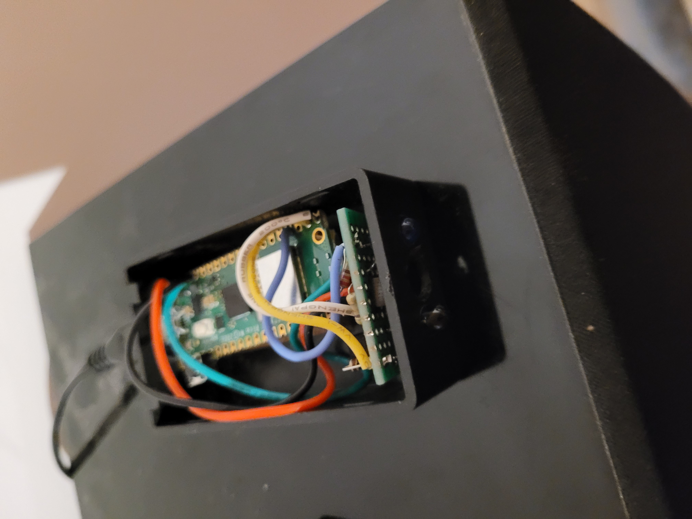

# WiFi Universal Remote

The WiFi Universal Remote provides a means to replace multiple handheld infrared remote controls with a web page that can be accessed from a mobile phone or tablet on the same WiFi network as the control device.

The control device is a small box that is plugged in and points at the systems to be controlled.

The web page presents a set of buttons that can each implement any series of control codes sent by the handheld remote controls with optional intervening pauses.  The buttons are programmed by the user in a setup procedure. There can be a hierarchy of control pages so you can, for example, have a simple control page for the most used operations and then detail pages that implement operations that are used less frequently.

Complete details in user manual (user-manual.odt)

